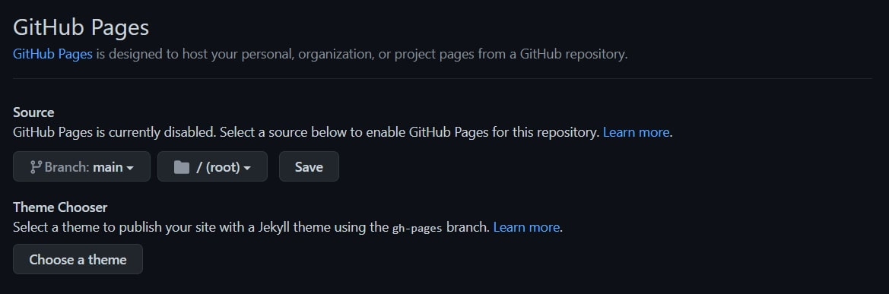

# Tetris

This is a single page site that allows people to play yet another remake of the classic Tetris game.
The site is targeted toward people who enjoy games, like Tetris. This site will be useful for people who are interested in having a taste of nostalgia or who have never played Tetris before and stumble across this version.


## Design

### Wireframes

To kickstart the project design process, a hand-drawn wireframe was created in order to visualise this project idea.


After discussing this idea during the Mentor Project Planning session, the wireframe for the chosen project idea was re-created digitally using Balsamiq.


### Typography

[Google Fonts](https://fonts.google.com/) and [Fontspace](https://www.fontspace.com/) were used to search for and select the following fonts for this game.

'[VT323](https://fonts.google.com/specimen/VT323?query=vt)' (from Google Fonts) was used for the stats and preview areas and '[Tetris 2](https://www.fontspace.com/tetris-2-font-f11520)' (from Fontspace by [Zombie Unicorn](https://www.fontspace.com/zombie-unicorn)) was used for the game title and menu texts.


### Colours

The site's colour scheme was chosen using [Coolers colour scheme generator](https://coolors.co/) and searching for [trending 'Tetris' colour palettes](https://coolors.co/palettes/trending/tetris).

I chose the following [colour palette](https://coolors.co/0341ae-72cb3b-ffd500-ff971c-ff3213) because it was the brightest.


### Planning and execution

As with the previous portfolio project, Agile practices were used and documented in Trello ([planning/design board](https://trello.com/b/hGTlOqew/project-planning-design) and [dev board](https://trello.com/b/Wk8poOE2/project-development)) and [Github Projects](https://github.com/DebzDK/tetris/projects/1).

*Please note that more task details + resources are available in the Trello boards than in the Github Project page.*

Each board is divided into 3 swimlanes/columns:

* 'To Do' - used to list tasks that are yet to be done
* 'In Progress' - used to list tasks that are currently being carried out
* 'Done' - used to list completed tasks

After defining the status divisions for a task, the indicators for time constraints were defined using 't-shirt sizes'.


‘T-shirt sizes’ were defined to provide an estimate for the perceived difficulty of a task and extra labels to further separate tasks by what part of the process they’re related to, i.e. Requirements, Design, Development, and Testing. The project area labels have been defined as follows:

* ‘Requirements’ - refers to things that are directly taken from or related to the project’s assessment criteria rather than actions derived from a requirements capture process
* 'Design' - refers to steps taken towards the appearance of the website
* 'Development' - refers to steps taken towards the implementation of the website
* 'Testing' - refers to steps taken towards validating the HTML and CSS as well as testing the responsiveness of the website

At this point, user stories were created in order to produce tasks while thinking from a user's perspective.


All other user stories follow the same kind of format except for where the user story is self-explanatory of the task.

*Please note that some user stories for 'Development' were not made at the time that the work was done as they should have been but have been added after the fact, using the time of relevant commits to provide a rough duration estimate.*

## Features

Each feature listed below was chosen to ultimately meet the project goal of portfolio project 2 - '...build an interactive front-end site. The site should respond to the users' actions, allowing users to actively engage with data, alter the way the site displays the information to achieve their preferred goals'.

A simple game of Tetris meets these requirements as follows:

* Responds to the users' actions by way of game controls and menu options
* Allows users to actively engage with data, i.e. playing the game
* Alters the way the site displays information through shape rotation, stats (score and level), and moving blocks through the grid

Here are the specific game features.

### Existing features

* Main menu
    * Users able to see a main menu before starting the game.

        

        From here, a user can start the game and view game controls, credits and the leaderboard.

* Game controls
    * Users are able to use the arrow keys on their keyboard to control the movement of the Tetris blocks as follows:

        

        *For mobile gameplay, these controls will be displayed underneath the stats area.*

* Game credits
    * Users are able to see a small scrolling thank you note I included.

        

* Current game score counter and level indicator - 'Stats' area
    * Users are able to see their current game score and level while playing a game.

        Initially, this area contains dots as a placeholder until a game has begun.

        

* Persisting highscore table/leaderboard
    * Users are able to view highscores that persist after closing the browser, or refreshing the webpage, and returning to the game.

        Ideally, this should've been implemented in a way where scores would persist between players on different computers but that would've gone beyong this scope of this project. Instead, scores are stored locally using `localStorage`.

        

* Multiplier for consequtive row clearing
    * In order to stay true to Tetris, I googled 'Tetris scoring system' and chose to base my code on the description given for the '[Original Nintendo scoring system](https://tetris.wiki/Scoring#Original_Nintendo_scoring_system)' provided by [Wikipedia](https://en.wikipedia.org/wiki/Main_Page).

        

        Resulting code:
        ```
        let level = 0;
        let currentScore = 0;
        let baseScorePerLinesCleared = [40, 100, 300, 1200];

        function incrementScore(numOfLinesCleared) {
            let baseScore = baseScorePerLinesCleared[numOfLinesCleared - 1] || baseScorePerLinesCleared[4];
            currentScore += baseScore * (level + 1);
        }
        ```

        *Note: I did not incorporate the extra points for the consequtive soft-dropping of blocks into spaces.*

* Next shape preview
    * Like in classic Tetris, there is an area where users can preview the next shape to fall which gives them a chance to strategise while playing the game.

        

* Shape rotation
    * Lastly, users are able to rotate falling shapes. Tetris simply wouldn't be Tetris without it.

        To achieve this, I found and used code from a YouTube tutorial called '[Tetris, Block Movement and Rotation](https://www.youtube.com/watch?v=iAGokSQQxI8&t=1590s)'. Alternatively, I could have stored all of the versions of the tetris block rotation states and achieved the same behaviour but I wanted to learn a smarter way to do it.

        I made use of and sectioned the referenced code toward the bottom of my [block.js](https://github.com/DebzDK/tetris/blob/main/assets/js/block.js#L131) file and modified as appropriate.
        
        

### Future features

* Programmable controls
    * This would enable users to control which keys would do what in the game. E.g. users could use W, A, S, D instead of the arrow keys for block movement.

* Ability to choose themes
    * This would enable users to select from a preset list of themes, or maybe even define their own, in order to change the colour scheme of the game.

        I would have used the other [trending tetris palettes from Coolors.co](https://coolors.co/palettes/trending/tetris).

* Difficulty modes
    * To set this game apart from the classic Tetris in some way, I would've used the usual difficulty (speed increase) coupled with something else such as, an ever-increasing or decreasing grid, the random appearance of unclearable blocks in the game, or some kind of sudden death type occurrence.

* Stats for fallen pieces
    * When searching for design ideas for my Tetris game using Google Images, one retro [design](https://miro.medium.com/max/1838/1*6cPm3UhWEMBpYja5LFtkGg.png) caught my eye:

        

        I thought the in-game display of statistics for fallen pieces was really cool and would've been easy enough to implement but I decided to leave it out of this version.

## Languages and technologies used

* Languages
    * [HTML5](https://en.wikipedia.org/wiki/HTML5) - used to create and structure webpages using semantic (meaningful) markup
    * [CSS3](https://en.wikipedia.org/wiki/CSS) - used Cascading Style Sheets to style HTML
        * [Flexbox](https://en.wikipedia.org/wiki/CSS_Flexible_Box_Layout) - used instead of `float` property for responsive web design
    * [JavaScript](https://en.wikipedia.org/wiki/JavaScript) - used to make webpages interactive

* Technologies
    * [Autoprefixer](https://autoprefixer.github.io/) - used to automatically add vendor prefixes for browser compatibility
    * [cloudconvert](https://cloudconvert.com/png-to-ico) - used to convert .png file for game icon into .ico file format
    * [Coolors](https://coolors.co/) - used to provide colour scheme for Tetris blocks
    * [EZGIF](https://ezgif.com/) - used to create GIFS for this README
    * [Trello](https://trello.com/) - used to document planning/design and development project progress and steps
    * [Git](https://git-scm.com/) - used for version control
    * [GitHub](https://github.com/) - used for internet hosting and version control through use of Git
    * [Gitpod](https://gitpod.io/) - used as online IDE for software development
        * The terminal was used to create branchs to work on before merging into the main branch. These branches have been preserved for the sake of the assessment, otherwise they would have been deleted after use.

        

## Testing

Evidence for this section has been placed in its own .md file which can be found [here](https://github.com/DebzDK/tetris/blob/main/TESTING.md).

## Deployment

The site was deployed to GitHub pages using the steps listed below: 
* In the GitHub repository, navigate to the Settings tab
* From the source section drop-down menu, select the 'main' branch
    
* Once the 'main' branch has been selected, the page will be automatically refreshed and indicate the state of deployment (which should eventually show as successful)
    
    

The live site can be found here - https://debzdk.github.io/tetris

### Local deployment

Since my work is in a publicly-accesible repository, it can be copied in 3 different ways:

1. Cloning the repository

    <code>git clone https://github.com/DebzDK/tetris.git</code>

1. Forking the repository

    

1. Using Gitpod to create a new workspace for the repository with this button: [](https://gitpod.io/#https://github.com/DebzDK/tetris)

## Credits

### Content

The code used to rotate Tetris blocks is sourced from a YouTube video called '[Tetris, Block Movement and Rotation](https://www.youtube.com/watch?v=iAGokSQQxI8&t=1590s)'. It details, step-by-step, how to create a Tetris game using React. The only steps followed and used in this project were the steps to achieve rotation in my [block.js](https://github.com/DebzDK/tetris/blob/main/assets/js/block.js#L131) file.

The rest of the code is based on my prior attempt at a Tetris game that I completed as a 2nd year assignment in university which was built using Java's JApplet.

### Media

Purpose | Credit | Source
------------ | ------------- | -------------
Favicon | [Vitaly Gorbachev](https://www.flaticon.com/authors/vitaly-gorbachev) | [Flat icon](https://www.flaticon.com/free-icon/tetris_824380)
Tetris music | [Downloads Khinsider](https://downloads.khinsider.com/) | [Tetris Gameboy 2 music](https://downloads.khinsider.com/game-soundtracks/album/tetris-gameboy-rip/tetris-gameboy-02.mp3)
Tetris gameover sound effect | [101 Soundboards](https://www.101soundboards.com/) | [Game Over sound effect](https://www.101soundboards.com/sounds/20902-game-over)

Seeing as Tetris is a huge game, I had to do my due diligence and check copyright regarding use of the music.

The theme song 'Korobeiniki' is a Russian folk song and is free-to-use but recordings of it are, in fact, copyrighted and therefore cannot be commercially used.
Thankfully, this game is non-commercial and simply an ode to my childhood in the form of a project.

## Acknowledgements

Thanks to my brothers for introducing me to the world of games and thanks again to my mentor [Tim Nelson](https://github.com/TravelTimN) for his encouragement and constructive feedback!
