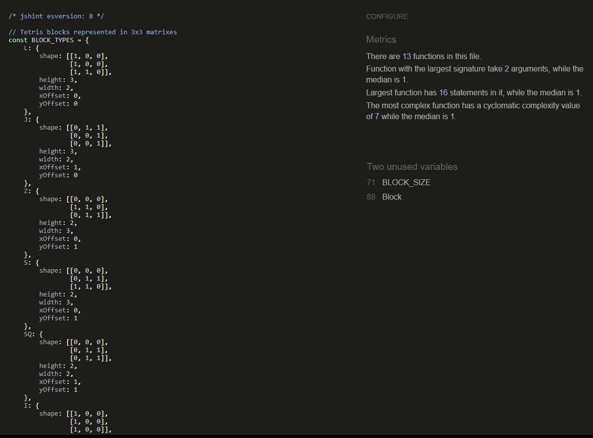
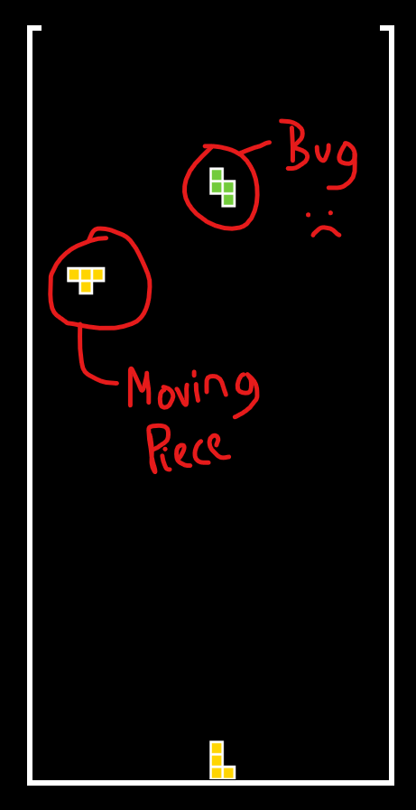

# Testing

## Validator testing
        
* HTML
    * 1 warning and 3 HTML errors were found, as shown below, after passing through the official W3C Markup Validator.

        

    * The warning and the errors were fixed, as shown below, and can be verified by clicking [here](https://validator.w3.org/nu/?doc=https%3A%2F%2Fdebzdk.github.io%2Ftetris%2F).
        

* CSS
    * No errors were found after passing through the official (Jigsaw) validator.
    This can be verified by clicking [here](https://jigsaw.w3.org/css-validator/validator?uri=https%3A%2F%2Fdebzdk.github.io%2Ftetris&profile=css3svg&usermedium=all&warning=1&vextwarning=&lang=en).
    * There are 21 warnings regarding the use of vendor extensions. The properties referred to in these warnings are necessary for browser compatibility in Chrome, Safari, IE/Microsoft Edge, and Firefox.
    
* JavaScript
    * [board.js](https://github.com/DebzDK/tetris/blob/main/assets/js/board.js)
        * No errors and 1 unused variable were found after passing through the official JSHint Code Quality Tool.
            
            *Note: The unused variable is actually referring to the class name so was not addressed.*
            
            

    * [block.js](https://github.com/DebzDK/tetris/blob/main/assets/js/block.js)
        * 1 warning and 2 undefined variables were found after passing through the official JSHint Code Quality Tool.
            
            *Note: The unused variable 'BLOCK_SIZE' is used in game.js and board.js and it is defined in block.js because it is a property/variable related to blocks so was not addressed. The other unused variable 'Block' is the name of the class so this was also ignored.*

            

        * The warning was fixed and the unused variables left as they are, as can be seen here:

            

    * [game.js](https://github.com/DebzDK/tetris/blob/main/assets/js/game.js)
        * 5 warnings, 6 undefined variables and 1 unused variable were found after passing through the official JSHint Code Quality Tool.
            
            *Note: The undefied variables 'BLOCK_SIZE, COLOURS, Block, Board, COLS, ROW' are used in game.js but defined in board.js and block.js as appropriate. I used the JSHint 'globals' to remove these specific warnings. The function with the cyclomatic complexity value of 12 is processMenuOption(). Seeing as the statements used were required for the behaviour of the game, I could not see a way to further reduce the complexity.*

            
        
        * These were all fixed as can be seen here:

            

* Accessibility
    * 4 error and 5 alerts were found after running the [WAVE Accessibility Evaluation tool](https://wave.webaim.org/report#/https://debzdk.github.io/pilates-your-guide-to-flexible-fun).

        
        

    * Manual foreground and background colour testing
        * Text
            
            Contrast Ratio: <b>[21:1](https://webaim.org/resources/contrastchecker/?fcolor=000000&bcolor=FFFFFF)</b>

        * Highlighted button text

            Contrast Ratio: <b>[21:1](https://webaim.org/resources/contrastchecker/?fcolor=FFFFFF&bcolor=000000)</b>

* Lighthouse
    * Initial report
        * Desktop
            * index.html

                
                

        * Mobile
            * index.html

                

                *Note: Mobile has the same accessibilty issues as shown for desktop*

## Unfixed bugs

* Hanging piece
    This issue was discovered when testing rotation and only happens after rotating a 'Z' and 'S' shape tetris block.

    

* Game display on mobile devices (dev tools)

## Fixed bugs