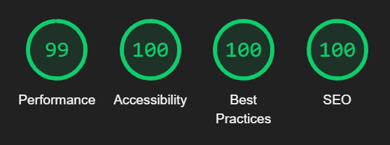

# Testing

## Validator testing
        
* HTML
    * 1 warning and 3 HTML errors were found, as shown below, after passing through the official W3C Markup Validator.

        

    * The warning and the errors were fixed, as shown below, and can be verified by clicking [here](https://validator.w3.org/nu/?doc=https%3A%2F%2Fdebzdk.github.io%2Ftetris%2F).
        

* CSS
    * No errors were found after passing through the official (Jigsaw) validator.
    This can be verified by clicking [here](https://jigsaw.w3.org/css-validator/validator?uri=https%3A%2F%2Fdebzdk.github.io%2Ftetris&profile=css3svg&usermedium=all&warning=1&vextwarning=&lang=en).
    * There are 21 warnings regarding the use of vendor extensions. The properties referred to in these warnings are necessary for browser compatibility in Chrome, Safari, IE/Microsoft Edge, and Firefox.
    
* JavaScript
    * [board.js](https://github.com/DebzDK/tetris/blob/main/assets/js/board.js)
        * No errors and 1 unused variable were found after passing through the official JSHint Code Quality Tool.
            
            *Note: The unused variable is actually referring to the class name so was not addressed.*
            
            

    * [block.js](https://github.com/DebzDK/tetris/blob/main/assets/js/block.js)
        * 1 warning and 2 undefined variables were found after passing through the official JSHint Code Quality Tool.
            
            *Note: The unused variable 'BLOCK_SIZE' is used in game.js and board.js and it is defined in block.js because it is a property/variable related to blocks so was not addressed. The other unused variable 'Block' is the name of the class so this was also ignored.*

            

        * The warning was fixed and the unused variables left as they are, as can be seen here:

            

    * [game.js](https://github.com/DebzDK/tetris/blob/main/assets/js/game.js)
        * 5 warnings, 6 undefined variables and 1 unused variable were found after passing through the official JSHint Code Quality Tool.
            
            *Note: The undefied variables 'BLOCK_SIZE, COLOURS, Block, Board, COLS, ROW' are used in game.js but defined in board.js and block.js as appropriate. I used the JSHint 'globals' to remove these specific warnings. The function with the cyclomatic complexity value of 12 is processMenuOption(). Seeing as the statements used were required for the behaviour of the game, I could not see a way to further reduce the complexity.*

            
        
        * These were all fixed as can be seen here:

            

* Accessibility
    * 4 error and 5 alerts were found and fixed after running the [WAVE Accessibility Evaluation tool](https://wave.webaim.org/report#/https://debzdk.github.io/tetris).

        
        
        

    * Manual foreground and background colour testing
        * Text
            
            Contrast Ratio: <b>[21:1](https://webaim.org/resources/contrastchecker/?fcolor=000000&bcolor=FFFFFF)</b>

        * Highlighted button text

            Contrast Ratio: <b>[21:1](https://webaim.org/resources/contrastchecker/?fcolor=FFFFFF&bcolor=000000)</b>

* Lighthouse
    * Initial report
        * Desktop
            * index.html

                
                

        * Mobile
            * index.html

                

                *Note: Mobile has the same accessibilty issues as shown for desktop*
    
    * Secondary report
        * Desktop
            * index.html report can be found [here](https://htmlpreview.github.io/?https://github.com/DebzDK/tetris/blob/main/documentation/reports/secondary-lighthouse-desktop-report.html)

                
        
        * Mobile
            * index.html report can be found [here](https://htmlpreview.github.io/?https://github.com/DebzDK/pilates-your-guide-to-flexible-fun/blob/main/documentation/reports/secondary-lighthouse-mobile-report.html)

                

    * Browser Compatibility
        * Desktop

            This project was developed and tested mainly using Chrome so that is the browser with which to have the best playing experience. It also appears normally on Firefox and Edge.

            Autoprefixer was used on style.css to cater for the potential styling issues that typically arise across different browers.

        * Mobile

            Sadly, the game was made entirely with medium to large desktops in mind as there wasn't enough time to fully test and ensure an enjoyable playthrough on mobile devices. It also isn't the best on smaller screens as the game doesn't scale well.
            
            I had attempted to do this, by using percentages to size elements but ran into the other issue of the fact that Canvas doesn't scale as lines drawn on it are rendered in pixels. I also tried scaling the canvases based on a factor found through calculations invovling the target device's width and height and the desired device width and height (larger screen dimensions).

            Although it doesn't scale, the game is visible and can be scrolled into view on a medium to large-size device.

## Fixed bugs

* Hanging piece
    
    This issue was discovered when testing rotation and only happens after rotating a 'Z' and 'S' shape tetris block.

    It was later fixed and no longer seems to occur.

    

## Unfixed bugs

* Border annihilation
    
    Each tetris block has a thick, white border that surrounds the block's set colour. When one block slides against the other, the white border of the resting block gets erased. I know that the bug is related to when I call the `drawRect()` function in my `drawBlock()` function but I couldn't find the write values to a) get the borders to slide up against each other without disappearing and b) not get ghost white lines where a block has fallen from due to the border not clearing fully.

* Rotate through the wall and other blocks... sometimes

    This issue was also discovered when testing rotation after fixing the 'hanging piece' bug.
    Sometimes, when rotating a block, it may overlap with an existing one.
